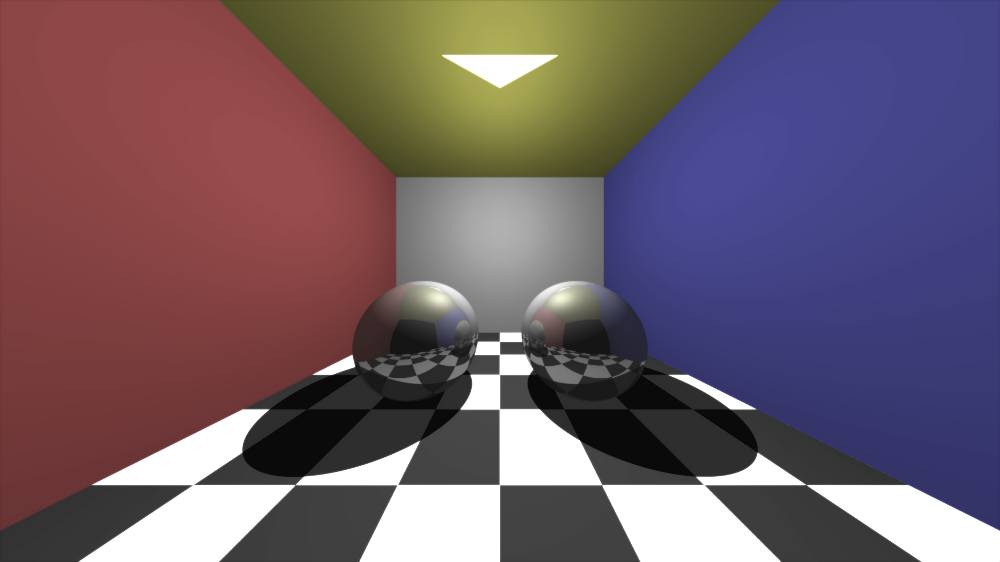
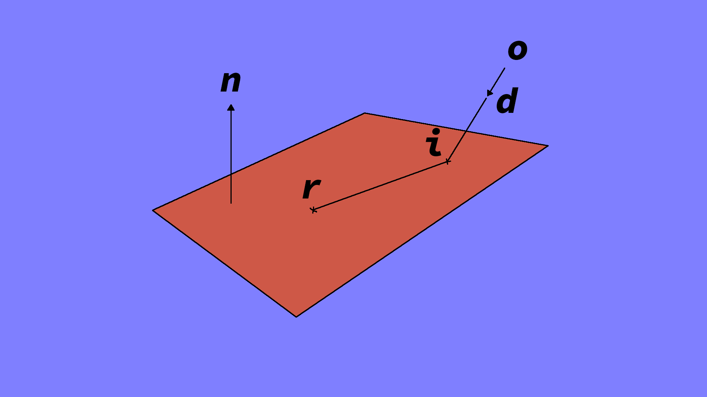
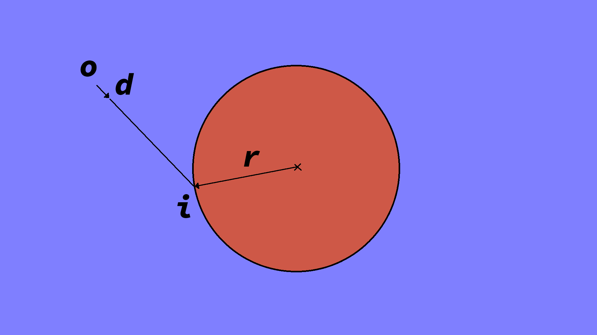

# Raytracer

A ray-tracer written completely in java.
+ Shadows
+ Reflections
+ Bloom postprocessing

# Running the jar
+ Download the latest executable for your OS (Windows/Linux/Mac) from the [releases page](https://github.com/TheGameDevDude/Raytracer/releases) and extract to a new folder.
+ Type the following command on your terminal to run the jar file : 
```
java -jar .\Raytracer.jar
```

# Ray Plane Intersection

line equation is: **o** + t**d** = **i**\
plane equation is: (**i** - **r**).**n** = 0\
substitute line equation in plane equation:\
(**o** + t**d** - **r**).**n** = 0\
**o**.**n** + t**d**.**n** - **r**.**n** = 0\
t = (**r**.**n** - **o**.**n**)/(**d**.**n**)

# Ray Sphere Intersection

line equation is: **o** + t**d** = **i**\
radius r = magnitude of **r** vector: r = |**r**|\
**r** vector is pointing at the intersection point **i**: **r** = **i**\
r = |**o** + t**d**|\
r<sup>2</sup> = (**o** + t**d**).(**o** + t**d**) since |**a**| = sqrt(**a**.**a**)\
solving the above equation we get:\
t<sup>2</sup> + t(2**o**.**d**) + (**o**.**o**) - r<sup>2</sup> = 0\
here a = 1, b= 2 * (**o**.**d**), c = (**o**.**o**) - r<sup>2</sup>\
by solving this quadrating equation we can find the distance t.